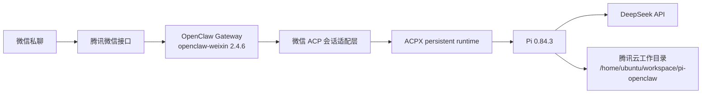

# 腾讯云 Pi + OpenClaw 微信部署学习项目

最后更新：2026-08-29 02:19 CST
执行者：Codex

这个仓库记录将本机轻量微信桥迁移为腾讯云上 **Pi + OpenClaw + 官方微信插件** 的过程。目标是：在微信私聊中直接向 Pi 提问，并让 Pi 在腾讯云工作目录中执行任务。

## 当前目标架构



模型推理由外部 API 完成；腾讯云负责微信长轮询、Gateway、Pi 进程、会话和工具执行。因此这不是本地模型部署。

## 当前状态

- ✅ 腾讯云上的 Gateway、微信官方插件、Pi、ACPX 与 DeepSeek 已安装并可用。
- ✅ 微信已扫码登录；插件收到了私聊消息并成功走过 OpenClaw 的模型回复链路。
- ✅ Pi 在服务器工作目录中可直接调用 DeepSeek。
- ✅ 为微信插件 `2.4.6` 部署了 ACP 会话适配层，使指定私聊可映射到 Pi 的持久 ACPX 会话。
- ⏳ 最后一步：需在适配层生效后从微信发送一条新消息，确认日志出现 ACPX/Pi 会话并收到回复。未完成这一步前，不把“微信每条消息由 Pi 执行”写成已验收。

> 发现与取舍：未适配的微信插件只做普通 Agent 路由，配置中的 `type: "acp"` binding 不会被编译成 ACP 会话，因而消息会落到 OpenClaw 内置 Agent。`scripts/patch-weixin-acp-binding.mjs` 只补齐官方插件缺少的会话匹配与 ACP 初始化，不替换其微信登录、长轮询或消息发送实现。

## 为什么从轻量桥切换

原本机方案是 Python `bridge.py`：微信 ClawBot Gateway → Pi RPC，并额外处理睡眠恢复、任务持久化、Pi 重启和工具输出截断。新方案把微信通道和会话路由交给 OpenClaw 官方插件，保留 Pi 作为 Agent 运行时。详细对比见 [架构说明](docs/architecture.md)。

## 运行边界

- Pi 会在腾讯云执行命令和读写文件，不能直接操作 Mac 本地文件。
- 微信登录凭据、模型 API Key、Gateway token、SQLite 会话与同步游标不进入本仓库。
- 同一个微信账号切换后，只保留一个正在运行的微信通道实例。

## 文件导航

- [部署步骤](docs/deployment.md)
- [验收记录](docs/acceptance.md)
- [架构与数据流](docs/architecture.md)
- [ACP 适配决策](docs/decisions/001-weixin-acp-binding-compatibility.md)
- [OpenClaw 脱敏配置模板](configs/openclaw.server.patch.json5)
- [Pi 脱敏配置模板](configs/pi-settings.server.json)
- [服务器自检脚本](scripts/verify.sh)
- [微信 ACP 适配补丁](scripts/patch-weixin-acp-binding.mjs)

## 最小验收

1. 腾讯云 Gateway 服务运行且仅监听本机回环地址。
2. `openclaw-weixin` 显示 `running`。
3. 在微信发送 `只回复：腾讯云 Pi ACPX 已接管。`，收到对应回复。
4. 同时确认 Gateway 日志出现 ACP 绑定会话，而不是仅有 `provider=deepseek` 的 OpenClaw 原生会话。
5. 服务器日志没有模型认证失败、通道掉线或 Pi 进程崩溃。

## 复现与升级

服务器上每次重装或升级微信插件后，先通过 `openclaw plugins inspect openclaw-weixin` 确认插件安装目录与版本；仅当版本仍是 `2.4.6` 时运行：

```bash
node /home/ubuntu/workspace/pi-openclaw/patch-weixin-acp-binding.mjs \
  /home/ubuntu/.openclaw/npm/projects/tencent-weixin-openclaw-weixin-7783ac86ba/node_modules/@tencent-weixin/openclaw-weixin
systemctl --user restart openclaw-gateway.service
```

脚本先校验包名、版本和源码锚点，失败时不会写入；首次写入时会在原文件旁保存 `.pre-acp-binding-2.4.6.bak` 备份。新版本必须重新审查并更新脚本，不能盲目复用旧补丁。
