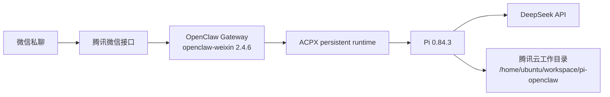

# 腾讯云 Pi + OpenClaw 微信部署学习项目

最后更新：2026-08-28 19:59 CST
执行者：Codex

这个仓库记录将本机轻量微信桥迁移为腾讯云上 **Pi + OpenClaw + 官方微信插件** 的过程。目标是：在微信私聊中直接向 Pi 提问，并让 Pi 在腾讯云工作目录中执行任务。

## 当前目标架构

模型推理由外部 API 完成；腾讯云负责微信长轮询、Gateway、Pi 进程、会话和工具执行。因此这不是本地模型部署。

## 为什么从轻量桥切换

原本机方案是 Python `bridge.py`：微信 ClawBot Gateway → Pi RPC，并额外处理睡眠恢复、任务持久化、Pi 重启和工具输出截断。新方案把微信通道和会话路由交给 OpenClaw 官方插件，保留 Pi 作为 Agent 运行时。详细对比见 [架构说明](docs/architecture.md)。

## 运行边界

- Pi 会在腾讯云执行命令和读写文件，不能直接操作 Mac 本地文件。
- 微信登录凭据、模型 API Key、Gateway token、SQLite 会话与同步游标不进入本仓库。
- 同一个微信账号切换后，只保留一个正在运行的微信通道实例。

## 文件导航

- [部署步骤](docs/deployment.md)
- [验收记录](docs/acceptance.md)
- [架构与数据流](docs/architecture.md)
- [OpenClaw 脱敏配置模板](configs/openclaw.server.patch.json5)
- [Pi 脱敏配置模板](configs/pi-settings.server.json)
- [服务器自检脚本](scripts/verify.sh)

## 最小验收

1. 腾讯云 Gateway 服务运行且仅监听本机回环地址。
2. `openclaw-weixin` 显示 `running`。
3. 微信发送一条文字，收到 Pi 的对应回复。
4. 服务器日志没有模型认证失败、通道掉线或 Pi 进程崩溃。
