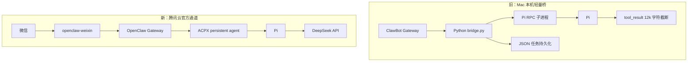
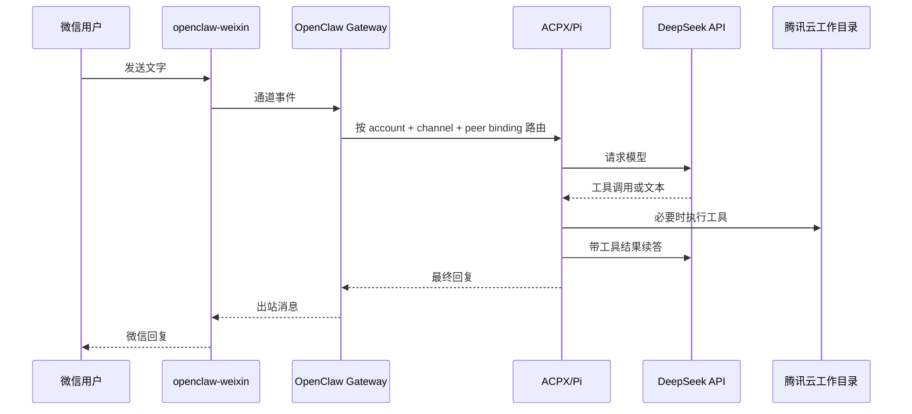

# 架构说明

更新时间：2026-08-28 19:59 CST
执行者：Codex

## 1. 两代微信接入方案

旧桥的关键补偿逻辑是：系统唤醒后重连、Pi 卡住检测与重启、任务重试、JSON 任务恢复、以及将单轮工具结果限制为 12,000 字符。官方通道替代了微信收发和会话调度；Pi 仍应避免大范围 `find`、`grep` 输出，以降低模型续答超时风险。

## 2. 消息与执行数据流

## 3. 配置责任边界

| 数据 | 存放位置 | 是否入库 |
|---|---|---|
| OpenClaw 路由、ACPX、会话隔离 | `~/.openclaw/openclaw.json` | 仅模板 |
| 微信登录 token 与同步游标 | `~/.openclaw/openclaw-weixin/` | 否 |
| Pi 模型设置 | `~/.pi/agent/settings.json` | 仅模板 |
| DeepSeek API Key | `~/.pi/agent/auth.json` | 否 |
| Pi 工作文件 | `/home/ubuntu/workspace/pi-openclaw` | 按项目决定 |
| Gateway 日志、会话数据库 | `~/.openclaw/` | 否 |

## 4. 资源预期

腾讯云当前为 4 vCPU / 3.6 GiB 内存。模型计算不发生在服务器上；单用户微信消息的主要资源是 Node Gateway、Pi 子进程和工具执行。现有机器可承担单用户低并发场景，但磁盘余量较小，应持续观察日志和会话增长。
