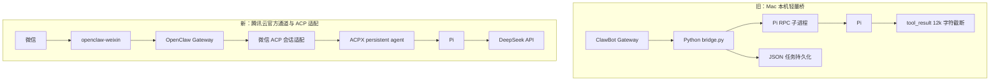
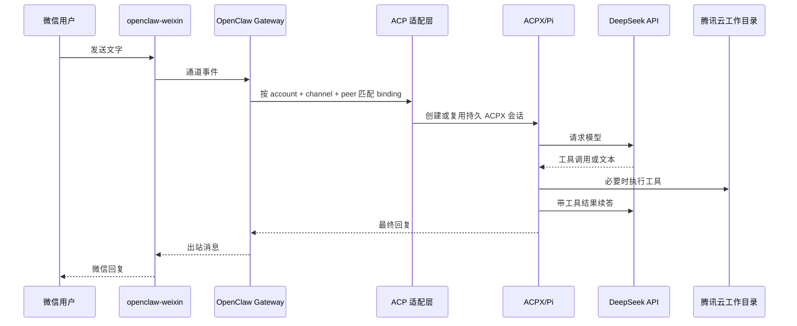

# 架构说明

更新时间：2026-08-29 02:19 CST
执行者：Codex

## 1. 两代微信接入方案

旧桥的关键补偿逻辑是：系统唤醒后重连、Pi 卡住检测与重启、任务重试、JSON 任务恢复、以及将单轮工具结果限制为 12,000 字符。官方通道替代了微信收发和会话调度；Pi 仍应避免大范围 `find`、`grep` 输出，以降低模型续答超时风险。

### 1.1 已验证的兼容性边界

`@tencent-weixin/openclaw-weixin@2.4.6` 会调用普通 `resolveAgentRoute` 并将消息交给 `dispatchReplyFromConfig`；它未实现 OpenClaw ACP 配置绑定所需的 `bindings.compileConfiguredBinding`、`bindings.matchInboundConversation`，也没有在入站消息前初始化配置的 ACP session。因此即使 `openclaw.json` 写入 `type: "acp"` binding，未适配状态下微信消息仍会成为 OpenClaw 内置模型会话。

仓库中的适配脚本只做两项补齐：

1. 让微信私聊 ID 可以参与 OpenClaw 的配置绑定编译和匹配。
2. 入站消息命中 binding 时先创建/复用 Pi 的持久 ACPX session，再把 session key 交给现有回复分发器。

脚本有包名、版本及源码锚点保护，版本限定为 `2.4.6`；它不保存凭据，也不替换微信官方插件的登录、长轮询和发送实现。

## 2. 消息与执行数据流

## 3. 配置责任边界

| 数据 | 存放位置 | 是否入库 |
|---|---|---|
| OpenClaw 路由、ACPX、会话隔离 | `~/.openclaw/openclaw.json` | 仅模板 |
| 微信登录 token 与同步游标 | `~/.openclaw/openclaw-weixin/` | 否 |
| Pi 模型设置 | `~/.pi/agent/settings.json` | 仅模板 |
| DeepSeek API Key | `~/.pi/agent/auth.json` | 否 |
| Pi 工作文件 | `/home/ubuntu/workspace/pi-openclaw` | 按项目决定 |
| Gateway 日志、会话数据库 | `~/.openclaw/` | 否 |

## 4. 验收证据分层

| 层级 | 当前结论 | 证据 |
|---|---|---|
| 微信接入 | 已通过 | 微信扫码成功，通道状态为 `running` |
| 普通 OpenClaw 回复 | 已通过 | 入站后 DeepSeek 返回 200，原生会话记录的 provider 为 `deepseek` |
| Pi 直接模型调用 | 已通过 | 服务器执行 `pi --no-tools -p` 返回预期文本 |
| 微信→Pi ACPX | 等待补丁后的新入站消息 | 适配脚本已部署，尚缺新消息产生的 ACP session 记录 |

## 5. 资源预期

腾讯云当前为 4 vCPU / 3.6 GiB 内存。模型计算不发生在服务器上；单用户微信消息的主要资源是 Node Gateway、Pi 子进程和工具执行。现有机器可承担单用户低并发场景，但磁盘余量较小，应持续观察日志和会话增长。
