# 腾讯云 OpenClaw 迁移验收

更新时间：2026-08-29 09:33 CST
执行者：Codex

```mermaid
flowchart LR
    N1[安装指定运行时] --> N2[迁移 Pi 配置与历史会话]
    N2 --> N2A[同步用户包与 Skill/扩展]
    N2A --> N3[安装 ACPX/微信插件]
    N3 --> N4[启动 loopback Gateway]
    N4 --> N5[微信扫码登录]
    N5 --> N6[写入精确 binding]
    N6 --> N7[补齐微信 ACP 适配]
    N7 --> N8[验证 Skill schema]
    N8 --> N9[导出历史会话]
    N9 --> N10[微信端到端 Pi 回复]
```

| Checkpoint | 预期行为 | 实际行为 | 状态 | 代码/命令证据 |
|---|---|---|---|---|
| N1 | Pi 与 OpenClaw 可执行 | Pi 0.84.3、OpenClaw 2026.7.1-2 已安装 | ✅ 通过 | `npm install -g`、`pi --version` |
| N2 | Pi 使用远端工作目录与默认模型配置 | `settings.json`、认证、`deepseek-responses` 扩展已迁移 | ✅ 通过 | `configs/pi-settings.server.json` |
| N2A | 本机用户包、Skill/扩展与会话可发现 | `pi list` 7/7；本机 29 个会话缺失数 0；旧桥会话隔离目录 4 个；备用 Qwen profile 1 个会话可导出 | ✅ 通过 | `pi list`、`find .../sessions`、`PI_CODING_AGENT_DIR` |
| N3 | ACPX 与微信官方插件可加载 | ACPX 2026.7.1、微信插件 2.4.6 均为 loaded | ✅ 通过 | `openclaw plugins inspect` |
| N4 | Gateway 仅回环监听且探针成功 | `127.0.0.1:18789`、`Connectivity probe: ok` | ✅ 通过 | `openclaw gateway status` |
| N5 | 微信账号登录 | 已扫码，微信插件显示 `running` | ✅ 通过 | `openclaw channels status --channel openclaw-weixin` |
| N6 | 指定微信私聊路由至 pi-wechat | account、channel、peer 与 ACP 配置已写入 | ✅ 通过 | `openclaw config get bindings` |
| N7 | 微信私聊可物化 ACPX/Pi session | v1 matcher 返回布尔值的问题已修复为 SDK 要求的对象/null；远端 v2 补丁已应用并重启 | ✅ 修复完成，⏳ 待微信触发 | `scripts/patch-weixin-acp-binding.mjs`、`scripts/patch-weixin-acp-binding.test.mjs`、Gateway 重启与探针 |
| N8 | Skill schema 可解析且可实际加载 | 5 个 `SKILL.md` frontmatter 有效；`eli5` 与 `skill-creator` 加载通过 | ✅ 通过 | 远端 `pi --skill ... -p ...` |
| N9 | 历史会话可读取和导出 | 代表 JSONL 会话导出 HTML 成功，365289 bytes | ✅ 通过 | 远端 `pi --export` |
| N10 | 微信收到 Pi 回复 | 等待补丁后的新测试消息 | ⏳ 待用户操作 | 微信消息、ACPX/Pi session 与 Gateway 日志 |

正向核对：N1→N9 均有命令或运行时证据；N10 必须在补丁后的新微信消息到达后完成。反向核对：Pi 配置、用户包、Skill、历史会话、ACPX、微信通道、binding 和适配脚本均覆盖流程图 N1→N9；尚无补丁后的 Pi session 记录，不能标记为微信端到端完成。
