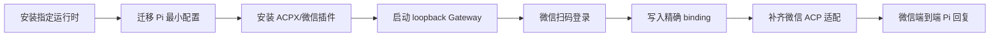

# 腾讯云 OpenClaw 迁移验收

更新时间：2026-08-29 02:19 CST
执行者：Codex

| Checkpoint | 预期行为 | 实际行为 | 状态 | 代码/命令证据 |
|---|---|---|---|---|
| N1 | Pi 与 OpenClaw 可执行 | Pi 0.84.3、OpenClaw 2026.7.1-2 已安装 | ✅ 通过 | `npm install -g`、`pi --version` |
| N2 | Pi 使用远端工作目录与默认模型配置 | `settings.json`、认证、`deepseek-responses` 扩展已迁移 | ✅ 通过 | `configs/pi-settings.server.json` |
| N3 | ACPX 与微信官方插件可加载 | ACPX 2026.7.1、微信插件 2.4.6 均为 loaded | ✅ 通过 | `openclaw plugins inspect` |
| N4 | Gateway 仅回环监听且探针成功 | `127.0.0.1:18789`、`Connectivity probe: ok` | ✅ 通过 | `openclaw gateway status` |
| N5 | 微信账号登录 | 已扫码，微信插件显示 `running` | ✅ 通过 | `openclaw channels status --channel openclaw-weixin` |
| N6 | 指定微信私聊路由至 pi-wechat | account、channel、peer 与 ACP 配置已写入 | ✅ 通过 | `openclaw config get bindings` |
| N7 | 微信私聊可物化 ACPX/Pi session | 微信插件 2.4.6 已增加受版本保护的 binding/初始化适配 | ✅ 部署完成 | `scripts/patch-weixin-acp-binding.mjs`、Gateway 重启与探针 |
| N8 | 微信收到 Pi 回复 | 等待补丁后的新测试消息 | ⏳ 待用户操作 | 微信消息、ACPX/Pi session 与 Gateway 日志 |

正向核对：N1→N7 均有命令或运行时证据；N8 必须在补丁后的新微信消息到达后完成。反向核对：Pi、ACPX、微信通道、binding 和适配脚本均覆盖流程图 N1→N7；尚无补丁后的 Pi session 记录，不能标记为端到端完成。
