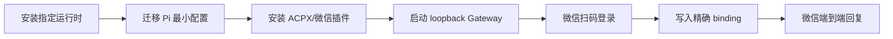

# 腾讯云 OpenClaw 迁移验收

更新时间：2026-08-28 20:07 CST
执行者：Codex

| Checkpoint | 预期行为 | 实际行为 | 状态 | 代码/命令证据 |
|---|---|---|---|---|
| N1 | Pi 与 OpenClaw 可执行 | Pi 0.84.3、OpenClaw 2026.7.1-2 已安装 | ✅ 通过 | `npm install -g`、`pi --version` |
| N2 | Pi 使用远端工作目录与默认模型配置 | `settings.json`、认证、`deepseek-responses` 扩展已迁移 | ✅ 通过 | `configs/pi-settings.server.json` |
| N3 | ACPX 与微信官方插件可加载 | ACPX 2026.7.1、微信插件 2.4.6 均为 loaded | ✅ 通过 | `openclaw plugins inspect` |
| N4 | Gateway 仅回环监听且探针成功 | `127.0.0.1:18789`、`Connectivity probe: ok` | ✅ 通过 | `openclaw gateway status` |
| N5 | 微信账号登录 | 二维码已生成，等待手机确认 | ⏳ 待用户操作 | `openclaw channels login --channel openclaw-weixin` |
| N6 | 指定微信私聊路由至 pi-wechat | 等待新 accountId | ⏳ 待 N5 | `openclaw config get bindings` |
| N7 | 微信收到 Pi 回复 | 等待测试消息 | ⏳ 待 N6 | 微信消息与 Gateway 日志 |

正向核对：N1→N4 已有命令证据，N5→N7 必须在扫码后完成。反向核对：当前已部署的 Pi、插件和 Gateway 均覆盖流程图 N1→N4；微信账号与最终消息尚未产生，不能标记为端到端完成。
